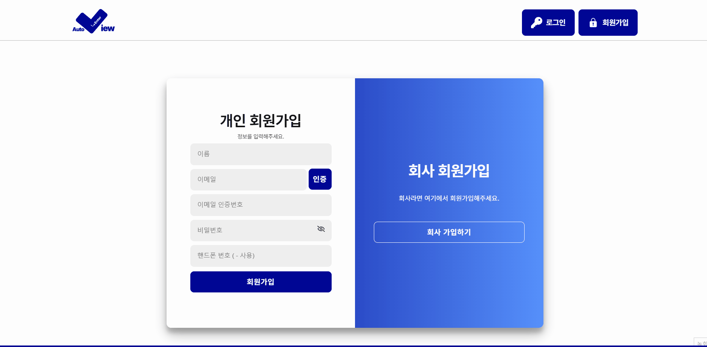
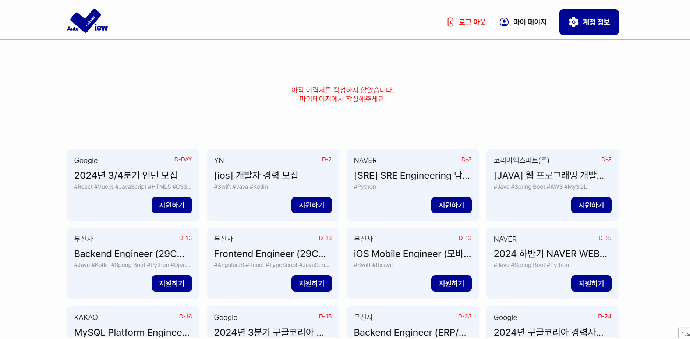
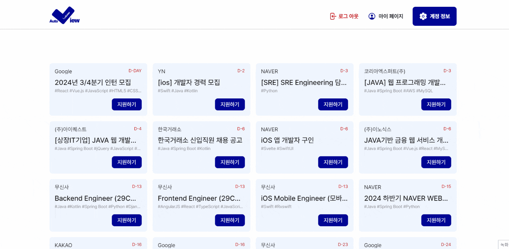
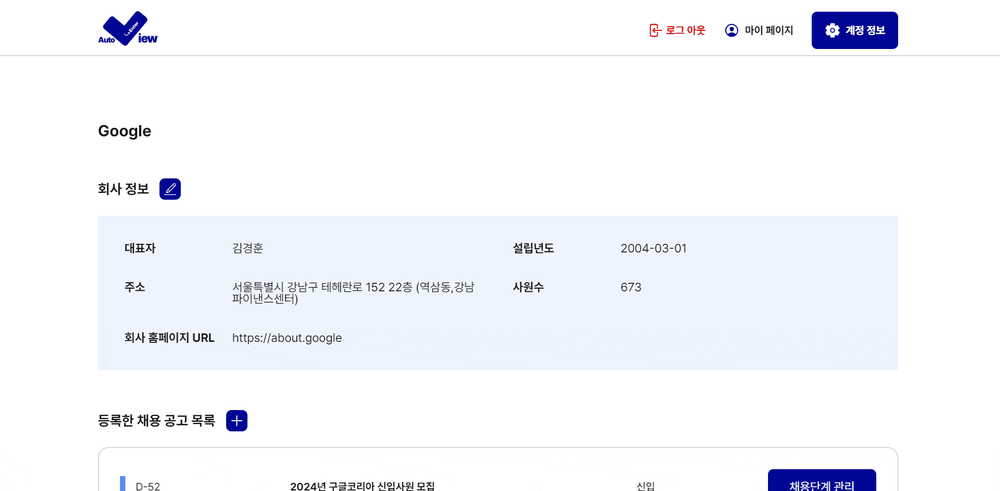
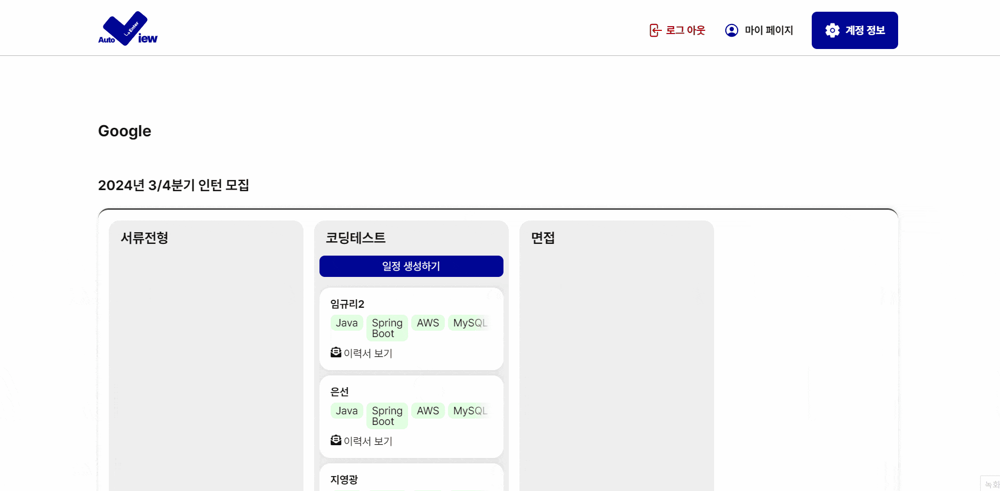
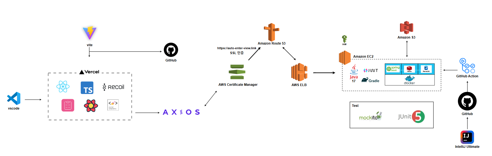

# Auto Enter View

> **제로베이스 프론트엔드 스쿨 23기**   **개발기간 : 24.06.24 ~ 27.08.01**
  
## 배포 주소

> **Auto Enter View** : [https://auto-enterview-fe.vercel.app/]  
> 채용 과정의 자동화, Auto Enter View와 함께해보세요. 
> 서류 심사부터 면접 일정 관리까지 자동으로 해결하고, 채용의 전 과정을 간편하게 만들어 드립니다.
  
## 프로젝트 Notion 주소

> **Notion** : [https://gray-heather-95a.notion.site/AutoEnterView-bad9c322c8104fc8bd86f4f86c6c7291]
  
## 목차
- [프로젝트 소개](#프로젝트-소개)
- [기술 스택](#Stacks)
- [화면 구성](#화면-구성)
- [주요 기능](#주요-기능)
- [Lighthouse 최적화](#Lighthouse-최적화)
- [아키텍처](#아키텍처)
- [와이어프레임](#와이어프레임)
- [FrontEnd 팀원 소개](#FrontEnd-팀원-소개)
  
## 프로젝트 소개

### 기획 배경

- 문제점: 개발자 인력 공급 급증으로 인해 소프트웨어 엔지니어 공고에 많은 지원자가 몰리고 있음
  - 신속한 서류 심사와 면접 진행이 중요해짐
  - 대량 지원자 처리 가능한 자동화 솔루션 필요
- 필요성: 채용 담당자의 단순 반복 작업을 최소화해야 함
  - 채용 업무 효율성 증대를 위해 자동화 서비스 필요

### 해결 컨셉

- 지원자 자동 필터링
  - 기준: 경력, 기술스택, 희망 직무, 학력
  - 유연성: 회사 상황에 맞게 필터링 기준 설정 가능
  - 효과: 서류 합격자 빠르게 선별
- 지원자 자동 필터링
  - 자동 배치: 서류 합격자 면접 일정 자동 배치
  - 자동 알림: 지원자에게 면접 일정 자동 알림

### 기대 효과

- 채용 업무 효율성 극대화
  - 서류 심사 단계 소요 시간 및 비용 절감
  - 평가 과정의 객관성 및 공정성 확보
  - 채용 담당자의 전략적 업무 집중 가능

---

## Stacks

### Environment

### Config

### Development

#### React library

### Communication

---

## 화면 구성

|                 메인 페이지/ 디테일 페이지                  |                  회원가입/ 로그인 /로그아웃                   |
| :---------------------------------------------------------: | :-----------------------------------------------------------: |
|  |      |
|             이메일찾기/ 비밀번호변경/ 회원탈퇴              |                [회사]마이페이지/ 채용공고 CRUD                |
|           |  |
|               [응시자]마이페이지/ 이력서CRUD                |                         채용단계 관리                         |
|  |        |
|                 일정 관리 및 메일 발송 예약                 |
|    |

---

## 주요 기능

### 메인 페이지/ 디테일 페이지

- 채용공고 무한스크롤

1. oberver를 이용해 사용자가 스크롤을 내리면 다음페이지를 불러오도록 했습니다.

- 채용공고 디테일

1. 작성했던 채용공고를 볼 수 있습니다.
2. 로그인하지 않아도 볼 수 있는 페이지 입니다.
3. 단계수별로 단계디자인을 보여주었습니다.
4. 마감날짜가 지난 공고에 접근하면, 유저와 비로그인유저를 구분하여 다른 페이지로 보내줍니다.

- 지원하기

1. 메인페이지와 디테일페이지에서 모두 지원할 수 있습니다.
2. 이력서가 없다면 지원할 수 없습니다.

### 회원가입 / 로그인/ 로그아웃

- 회원가입

1. 이메일 양식이 맞지 않으면 “@” 포함하라는 문구
2. 이메일 중복인증 후 인증번호 발송
3. 비밀번호 암호화
4. 비밀번호 유효성 검사 포함
5. 이메일 인증번호가 일치하지 않으면 회원가입 불가능
6. 회사 계정은 회사명 입력, 회사 전화번호 입력
7. 개인, 회사 가입 시 로그인 화면으로 이동

- 로그인

1. 이메일 양식이 맞지 않으면 “@” 포함하라는 문구
2. 비밀번호 유효성 검사 포함
3. 로그인 버튼을 클릭 시 메인화면으로 이동
4. 이메일 찾기 버튼 클릭 시 이메일 찾기 페이지로 이동

- 로그아웃

### 이메일찾기 / 비밀번호변경/ 회원탈퇴

- 이메일 찾기

1. 가입 시 이름과 휴대폰 번호로 이메일 찾기 가능
2. 정보를 입력하지 않으면 이메일 찾기 불가
3. 회사는 이메일 찾기를 지원하지 않음
4. 이메일을 찾으면 모달창으로 이메일 알려줌

- 비밀번호 변경

1. 가입 시 비밀번호가 일치 하지 않으면 경고 문구
2. 새로운 비밀번호와 한번 더 비밀번호가 일치하지 않으면 경고 문구
3. 세가지 비밀번호가 일치하면 비밀번호 변경
4. 비밀번호 유효성 검사 포함

- 회원탈퇴 : 회원 탈퇴 시, 모든 정보가 날아가며 메인화면으로 이동합니다.

### [회사] 마이페이지 / 채용공고 CRUD

- [회사] 마이페이지

1. 회사 권한인 사용자만 접근할 수 있습니다.
2. 회사정보와 작성한 채용공고 목록을 조회하여 보여줌
3. 생성/수정/삭제가 가능합니다. 회사정보는 문자열과 숫자를 검사하며, 다 채우지 않으면 전달되지 않도록 합니다.

- 채용공고 CRUD

1. [생성] :제목, 직무, 단계등을 추가하여 채용공고를 생성할 수 있습니다
   react-select와 react-datapicker를 커스텀해서 예쁘게 보여주었습니다. 공통적으로 쓰는 input을 컴포넌트화 하였습니다.

2. [수정]
   필터링되는 값들을 제외하고 수정할 수 있습니다.

3. [삭제]
   채용공고 삭졔: 지원자가 있다면 삭제할 수 없습니다.

### [응시자]마이페이지/ 이력서CRUD

- 응시자 마이페이지 : 개인 권한의 사용자만 접근할 수 있습니다. 응시자 정보, 지원한 공고 목록을 조회하여 보여주고, 이력서를 생성/수정/삭제 할 수 있습니다. [이력서 생성] 버튼은 이력서가 있을 경우 [이력서 보기] 버튼으로 변경됩니다.

- 이력서 CRUD

1. [생성]
   1. 한 줄 소개와 이미지, 기본 정보 입력
   2. 희망 직무, 기술 스택, 최종 학력 그리고 날짜를 자유롭게 필드 입력 가능
   3. 경력, 자격/어학/수상, 교육/경험/수료 그리고 날짜를 자유롭게 필드 입력 가능
   4. 포트폴리오 URL로만 입력 가능하며 클릭 시 해당 URL로 새창 띄워짐
2. [조회, 수정]

   1. 생성 시 등록했던 모든 정보 조회, 수정에서는 추가로 필드 입력 가능

3. [삭제] : 사용자 경험상 혼란을 줄 수 있어서 고민 후 기능삭제
   1. 이력서 정보가 삭제되며, 마이페이지로 이동하며 "이력서 생성"으로 바뀜

### 채용단계 관리

- 채용단계 정보 조회

1. 현재 공고에 지원한 지원자들을 한 눈에 관리할 수 있습니다.
2. 단계 별 남아있는 지원자들과 생성해둔 일정 내역이 보여집니다.
3. RactQuery로 캐싱해두어 일정이 생성되고 단계가 넘어갈 때마다 refetch가 가능합니다.

- 응시자 다음 단계로 넘기기

1. 여러 명의 지원자를 선택하여, 한 번에 다음 단계로 넘길 수 있습니다.
2. 현재 진행 중인 단계의 응시자들을 선택할 수 있으며, 응시자들에게는 주요 정보인 기술스택과 이력서를 볼 수 있는 링크가 포함되어 있습니다.

- 일정 삭제

1. 일정이 생성되면 일정 삭제 버튼이 활성화 됩니다.
2. 여러 개의 면접 일정이 생성된 경우에도 전체 일정이 삭제되어 다시 일정을 생성하실 수 있습니다.

### 일정 관리 및 메일 발송 예약

- 일정 생성

1. [과제] 일정과 [면접] 일정이 탭으로 구분되어 있습니다.
2. 과제는 마감 날짜만 선택하면 자동으로 23:59 에 저장되며, 면접은 간격, 횟수를 지정하여 여러 개의 면접일정을 생성할 수 있습니다.
3. 면접 일정은 현재 단계의 응시자 인원수에 맞게 개인 면접 일정이 생성됩니다.

- 메일 예약

1. 일정을 생성하시면 다음 단계에서 메일 예약이 가능합니다.
2. 메일을 예약하지 않고 창을 닫으셨어도, 일정이 생성되어 있다면 [일정 생성]이 [메일 예약] 버튼으로 변경되어 메일을 예약하실 수 있습니다.

---

## Lighthouse 최적화

### Before

### After

---

## 아키텍처

---

## 와이어프레임

> [https://www.figma.com/embed?embed_host=notion&url=https%3A%2F%2Fwww.figma.com%2Fdesign%2F5ljYgmZD1RoqItfpoz8WaO%2FEnterview%3Fnode-id%3D0-1]

---

## FrontEnd 팀원 소개

|                       송유나                        |                       옥예원                        |                       천지윤                       |
| :-------------------------------------------------: | :-------------------------------------------------: | :------------------------------------------------: |
|  |  |  |
|       [@songuna](https://github.com/songuna)        |       [@okyewon](https://github.com/okyewon)        |    [@cheonjiyun](https://github.com/cheonjiyun)    |
|           제로베이스 프론트엔드 스쿨 23기           |           제로베이스 프론트엔드 스쿨 23기           |          제로베이스 프론트엔드 스쿨 23기           |

